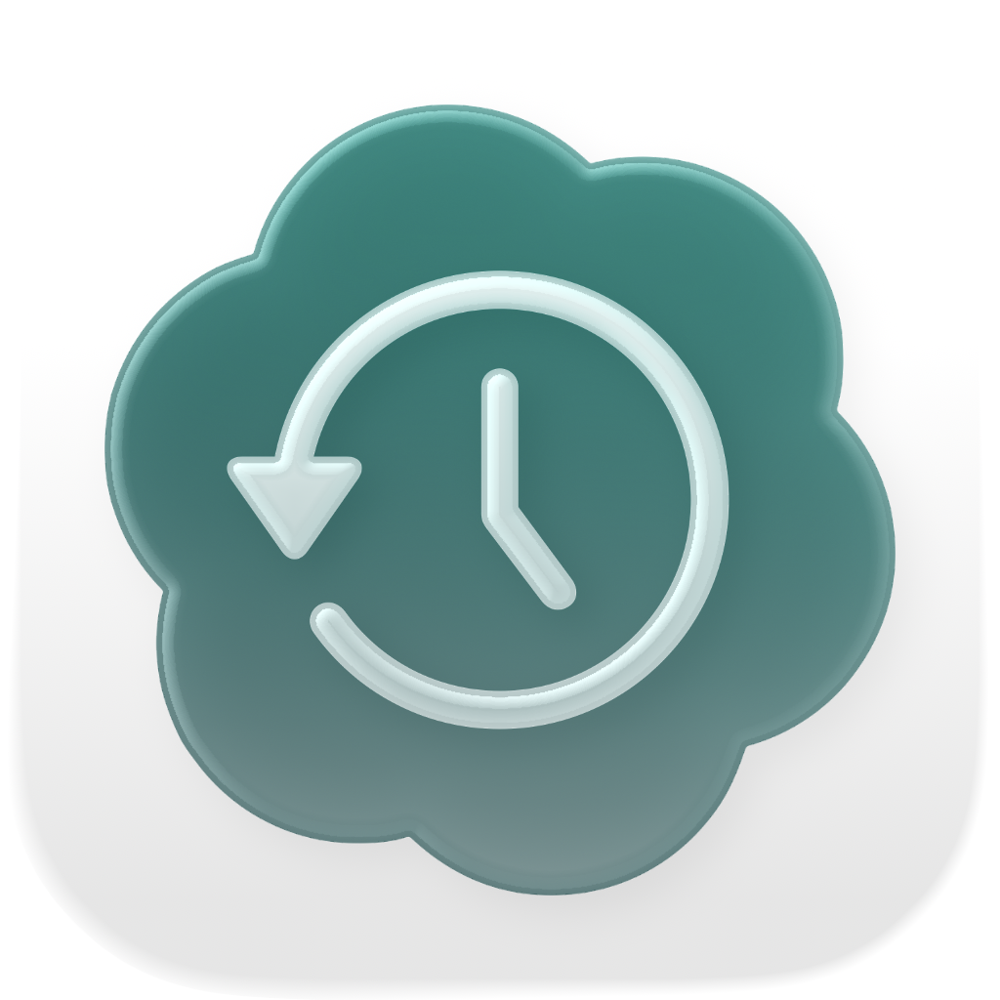

<p align="center">
  
</p>

# Histodex

A native, offline macOS archive for Codex conversation history. **Codex is an import format. Histodex is the archive.**

> [!CAUTION]
>
> Histodex is still in early development. Some license-related materials, including acknowledgements, may currently be missing. These will be added after the core functionality is complete.

## Use

Open `Histodex.xcodeproj` in Xcode 16 or newer with Swift 6 support, select the Histodex scheme, and run on macOS 14 or newer. Dependencies are pinned; the first build needs internet access. The application does not.

1. Open **Histodex → Settings…** (⌘,) and click **Choose Folder…** to select your `.codex` directory. Hidden folders are visible in the picker.
2. Histodex snapshots rollouts from `sessions/` and `archived_sessions/` and optional Codex title metadata (the name index and state database/WAL), then parses its own copies. Source files are never modified. Progress, cancellation and errors stay in Settings.
3. Choose a conversation from the date-grouped sidebar. The search field finds titles, projects, dates and conversation content; selecting a content result opens its exact item.
4. Read lightly tinted user messages on the right and assistant replies in the centered reading column. Conversation Info → **Browse All Records…** opens a separate searchable window for commands, reasoning, injected instructions, session activity and unknown records. Earlier/later navigation appears at the edges of the transcript, and your reading position is restored.
5. Use the ellipsis beside an entry for readable full text, original archived text, attachments and provenance. Long output is paged. Missing attachments remain explicit.
6. Use **Update Archive** or **Rebuild Conversation Index** in Settings for archive maintenance. Parser updates automatically repair existing conversations from owned snapshots. Manual rebuilding also works without Codex; Update Archive refreshes saved Codex titles.

Imported data lives in the application's sandbox Application Support directory, under `Histodex/`: SQLite, `raw/`, content-addressed `assets/sha256/`, and working directories. Keep that entire directory when backing up the archive; the database alone does not contain raw data or image bytes.

## Implemented

- Independent, deterministic prefix snapshots; safely repeatable transactional imports and cancellation.
- Plain JSONL and streamed Zstandard decoding, with raw compressed and decoded representations retained.
- Tolerant Codex adapter for messages, readable reasoning, commands, tools/results, patches, image generation and system events. Unknown/malformed records retain source provenance and raw bytes.
- Inherited rollout prefixes with byte/ordinal bounds, cycle detection and visible incomplete-history notices.
- SQLite/GRDB migrations, semantic record categories, scoped FTS5 search, bounded database pages and exact-item navigation.
- Archived Codex conversation names, request-based fallback titles, and automatic offline repair of older projections.
- SHA-256 asset deduplication; inline images, structured local images, Markdown images, generated images, and recognized audio references. Unavailable assets remain explicit.
- Native AppKit transcript, swift-markdown attributed text, on-demand ImageIO thumbnails, disclosure controls and reading-position restoration.
- App Sandbox, read-only user-selected file access and read-only security-scoped bookmarks. No telemetry or network requirement.

## Build and validate

```sh
zsh Scripts/core.sh test
zsh Scripts/build-app.sh
```

Scripts put caches, temporary files, test fixtures and build products in the ignored `.tmp/` directory. The application script makes an ad-hoc signed development build at `.tmp/build/app/Build/Products/Debug/Histodex.app`. For distribution, use an appropriate Developer ID signing configuration and notarization in Xcode; the development build is not notarized.

An optional real-fixture regression test reads an already copied, project-local Codex source folder:

```sh
HISTODEX_REAL_FIXTURES="$PWD/.tmp/real-source" zsh Scripts/core.sh test
```

Never commit private rollout fixtures. The test suite generates synthetic fixtures under `.tmp/tests/` and removes its own per-test artifacts.

See [Conversation Design](Docs/ConversationDesign.md) for the FlowDown-inspired AppKit interface and code-only validation, and [FlowDown Reference](Docs/FlowDownReference.md) for the inspected source revision and adaptation details. See [Architecture](Docs/Architecture.md) for source research and dependency decisions, and [Validation](Docs/Validation.md) for verified behavior and current limits. Full dependency licenses are bundled under `Histodex/Notices/`.
